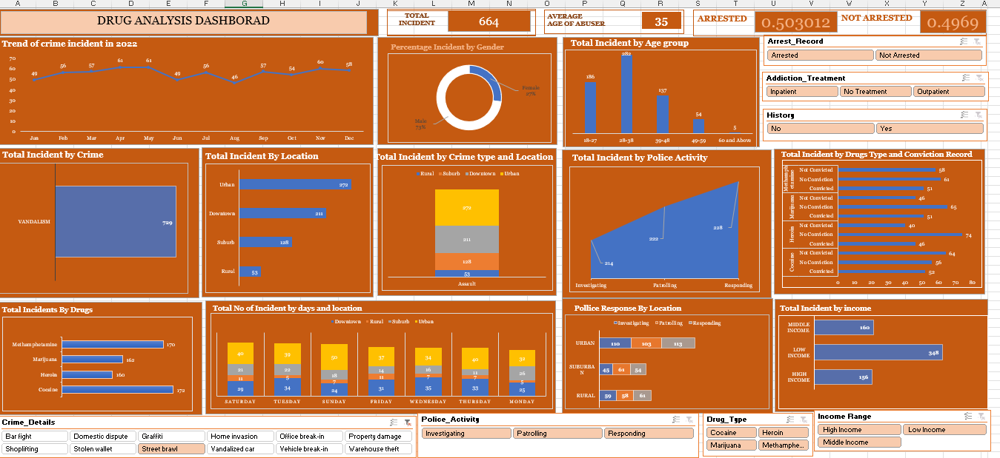

# Drug Abuse: Exploring the Nexus between substance Abuse and diverse criminal Activities


# This is a Excel project
Excel will be used for this project, by utilizing its built-in features for data filtering, sorting, and pivot tables to explore trends and relationships within the data. Additionally, Excel's charting capabilities can help visualize patterns and summarize key insights from the dataset.


# Table of contents 

- [Objective](#objective)
- [Data Source](#data-source)
- [Stages](#stages)
- [Design](#design)
- [Project Scope](#project-scope)
- [Development](#development)
  - [Pseudocode](#pseudocode)
  - [Data Exploration](#data-exploration)
  - [Data Cleaning](#data-cleaning)
  - [Data Transformation](#data-transformation)
-[Visualization](#visualization)
- [Analysis](#analysis)
  - [Project Insight](#project-insight)
- [Recommendations](#recommendations)


# Objective 

- What is the key pain point? 

  Non-Governmental Organization eager to address a critical issue,the escalating criminal activities ostensibly linked to substance abuse.


- What is the ideal solution? 

- Data Integration and validation: Establish robust data integration processes to compile and validate diverse datasets related to substance abuse and criminal activities, 
  ensuring data consistency and accuracy. 
- Descriptive Analysis: Perform descriptive data analysis to summarize key statistics and metrics related to drug-related crimes. 
- Frequencies, location trends, and drug types involved.
- Trend Identification: Identify and document temporal trends in drug-related crimes, such as seasonal variations or long-term increases or decreases, using time-series 
  analysis.
- Location Analysis: Conduct location-based analysis to pinpoint geographical hotspots of drug-related criminal activities, supporting focused law enforcement efforts.
- Data Visualization: Develop clear and intuitive data visualizations, such a chart, graphs, using  Excel to present analytical findings for easy interpretation by 
  stakeholders.

This will help the Non-Governmental Organization to the address criminal activities and the substance abuse issues.


## User story 

The Non-Governmental Organization want to use a dashboard to address the critical issue, the escalating criminal activities ostensibly linked to substance abuse.

This dashboard should allow me to the address criminal activities and the substance abuse issues

With this information, I can make more informed decisions about which Youtubers are right to collaborate with, and therefore maximize how effective each marketing campaign is.


# Data source 

- What data is needed to achieve our objective?

## Data Description

- Incident_ID: A unique identifier for each incident.
- Crime_Type: The type of crime committed in the incident (e.g., Theft, Vandalism, Assault).
- Crime_Location: The location where the crime took place (e.g., Urban, Downtown, Rural).
- Crime_DateTime: The date and time when the crime occurred.
- Crime_Details: A brief description of the specific details of the crime in each incident.
- Drug_Type: The type of drugs involved or related to the incident (e.g., Heroin, Cocaine, Methamphetamine, Marijuana).
- Abuser_Age: The age of the individual involved in the incident.
- Abuser_Gender: The gender of the individual involved in the incident.
- Treatment_History: Indicates whether the individual involved in the incident has a history of drug addiction treatment (e.g., "Yes" or "No").
- Demographic_Data: Information about the demographic background of the individual involved, such as their living area and income level.
- Arrest_Record: Indicates whether the individual was arrested in connection with the incident (e.g., "Arrested" or "Not Arrested").
- Conviction_Record: Indicates whether the individual has a prior conviction related to the incident (e.g., "Convicted" or "Not Convicted").
- Police_Activity: Describes the police activity related to the incident (e.g., "Investigating," "Patrolling," "Responding").
- Hospital_Admission: Indicates whether the individual was admitted to a hospital as a result of the incident (e.g., "Yes" or "No").
- Overdose_Incident: Indicates whether the incident involved an overdose (e.g., "Yes" or "No").
- Addiction_Treatment: Specifies whether the individual is receiving addiction treatment as a result of the incident (e.g., "Inpatient" or "Outpatient").


Where is the data coming from? The data is sourced from the Non-Governmental Organization.


# Stages

The stages for this project will be;
- Design
- Development
- Analysiss 

 
# Design 

## Dashboard components required
What should the dashboard contain based on the requirements provided?
To understand what it should contain, we need to figure out what questions we need the dashboard to answer:
-	Total incident
-	Average age of abuser
-	Trend of crime incident in 2022
-	Arrested
-	Not arrested
-	Percentage Incident by Gender
-	Total Incident by Age group
-	Total Incident by Crime
-	Total Incident by Location
-	Total Incident by Crime type and Location
-	Total Incident by Police Activity
-	Total Incident by Drugs Type and Conviction Record
-	Total Incidents by Drugs
-	Total No of Incident by days and location
-	Be user-friendly and easy to filter/sort
-	Use the most recent data possible

# Slicer 
- Crime Details
- Police Activity
- Drug types
- Income Ranges
- Pollice Response by Location
- Total Incident by income


# Project Scope

| Tool | Purpose | Description |
| --- | --- | --- |
| Excel | Data Collection | Gather data related to substance abuse and criminal activities from various sources, Organize this data into structured Excel spreadsheets for analysis. |
| Excel| Cleaning, Transformation and Validation | Conduct thorough data cleaning procedures with Excel to address issues such as missing values, duplicate entries, and formatting inconsistencies. |
| Excel |Exploratory Data Analysis (EDA) |Utilize Excel’s built-in statistical functions and tools to perform descriptive data analysis. Calculate key summary statistics, for crime frequencies, drug types, and demographics.|
| Excel | Visualizing the data via interactive dashboards | based data visualizations, Ensure that reports are structured for easy consumption by decision-makers. |
| GitHub | Hosting the project documentation and version control |


# Development

## Pseudocode

What’s the general approach in creating this solution from start to finish?
1.	Get the data - Data Importation: Non-Governmental Organization data is imported from its data source into Excel system.
2.	Explore the data in Excel
3.	Load the data into Excel system
4.	Data Cleaning, in Excel
5.	Data Transform in Excel
7.	Data Analysis: The dataset is explored and analysed
8.	Pivot Table and Slicer
4.	Dashboard creation - Data Analysis & Visualization The dataset is visualized in form of dashboard, reports.
5.	Generate the findings based on the insights
6.	Write the documentation + commentary and sent to the Non-Governmental Organization.stakeholders.
8.	Publish the data to GitHub Pages


STEPS
Dulipcate dataset to another sheet to keep raw dataset
Check dataset for duplicates
Condense age into age brackets
Removing null values and replacing it with "No Treatment"
Create a table with the dataset
Create a Pivot table for data exploration and data visualization
Create dashboard


#  Data Exploration 

This is the stage where you have a scan of what’s in the data, errors, inconsistencies, bugs, weird and corrupted characters etc
What are your initial observations with this dataset? What’s caught your attention so far?
1.	There are at least 3000 columns that contain the data we need for this analysis, which signals we have everything we need from the file without needing to contact the client for any more data.
2.	We need to create the age range column using a formular or an expression.

# Data Cleaning
- What do we expect the clean data to look like?
The aim is to refine our dataset to ensure it is structured and ready for analysis.
The cleaned data should meet the following criteria and constraints:
- Only relevant columns should be retained.
- All data types should be appropriate for the contents of each column.
- No column should contain null values, indicating complete data for all records.
- What steps are needed to clean and shape the data into the desired format?

# Data Transformation
=TEXT([@[Crime_Date]], "dddd") Crime_day exploration

1. Create a custom column for Age range, this can be done using a formular or an expression.
2. Max - Min ÷ number of ranges (65 - 18  / ÷ 7) = 6.71 approximately  7
3. Then click on Transform data, Power Query , click on add column, custom column 

### Age Range

   ```sql
   
= Table.AddColumn(#"Changed Type", "Age Range", each if [Age] >= 18 and [Age] <= 25 then "18-24"
else if [Age] >= 25 and [Age] <= 31 then "25-31"
else if [Age] >= 32 and [Age] <= 38 then "32-38"
else if [Age] >= 39 and [Age] <= 45 then "39-45"
else if [Age] >= 46 and [Age] <= 52 then "46-52"
else if [Age] >= 53 and [Age] <= 59 then "53-59"
else "Above 60")

```
Click on Close & Apply then Age Range column is created using the formula and then the visualisation.


# Visualization




# Analysis
Project Insight
What did we find?

Trend of Crime in 2022: Crime incidents saw a peak in June and then a gradual decline towards the end of the year.

- Crime Types: Theft is the most common crime, followed closely by burglary and vandalism.

- Incident by Location: Most incidents occur in urban areas, with downtown and suburban areas showing relatively similar counts. Rural areas have the fewest incidents.

- Gender Statistics: Males are involved in a significant majority of incidents, representing 70% of the total.

- Age Group Data: The majority of incidents involve individuals in the 18-27 and 28-38 age groups.

- Police Activity: Most incidents occur while the police are investigating, with fewer during patrolling and responding.

- Drug Incidents: Methamphetamine and Marijuana-related incidents are the highest, with their counts being close.

- Daily Incident Distribution: Incidents are fairly evenly distributed across the days of the week, with slight peaks on Mondays and Tuesdays.

- Police Response by Location: Urban areas have a higher police response in all categories (investigating, patrolling, responding) compared to suburban and rural areas.

- Drug Type and Conviction: For most drug types, the number of incidents where individuals were not convicted exceeds those where they were convicted.

Income and Incidents: Low-income individuals are involved in the highest number of incidents, followed by middle-income and high-income individuals.


# Recommendations
What do you recommend based on the insights gathered?

Crime Prevention: Given the high incidents of theft, consider launching public awareness campaigns and community policing initiatives specifically targeting theft prevention.

- Urban Area Focus: Allocate more police resources and surveillance to urban areas due to the higher number of incidents.

- Youth Engagement: Develop youth engagement programs to address the high involvement of the 18-27 age group in incidents. 

This could include educational campaigns about the dangers of drugs and criminal activity.

- Police Patrol Strategy: Re-evaluate patrolling strategies, especially since most incidents occur during investigation periods.

- Drug Rehabilitation: Given the high numbers of methamphetamine and marijuana-related incidents, consider introducing or expanding drug rehabilitation

 and counseling services targeting these specific drug users.

- Low-Income Areas: Special attention and resources should be directed towards low-income areas or demographics, as they are involved in the highest number of incidents.

- Legal System Review: The high number of non-convictions across various drug types suggests a need to review and potentially reform aspects of the legal system or the

 evidence-gathering processes.

- Community Policing: Encourage community policing and community watch programs, especially in high-incidence areas.

- Data Continuation: Continually update and review the dashboard to adapt strategies and interventions based on changing trends and patterns.

- Gender-Specific Programs: Given the higher male involvement in incidents, consider gender-specific interventions or programs targeting males.

